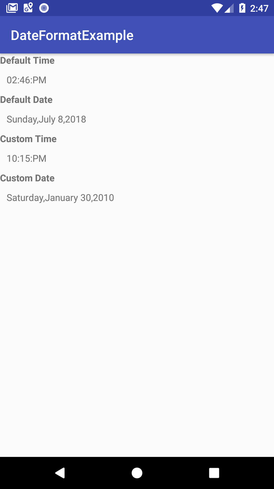

# Zero


To get a Git project into your build:

Step 1. Add the JitPack repository to your build file

gradle
maven
sbt
leiningen
Add it in your root build.gradle at the end of repositories:

	allprojects {
		repositories {
			...
			maven { url 'https://jitpack.io' }
		}
	}
Step 2. Add the dependency

	dependencies {
	         implementation 'com.github.rajendrarajaram:zero:v1.2'
	}
[](https://jitpack.io/#rajendrarajaram/zero)


This library have two important Views Called **TimeTextView** and **DateTextView**
Let's discuss how to use it : 

**TimeTextView**

```xml
<io.github.rajendrarajaram.zero.TimeTextView
        android:padding="10dp"
        android:layout_width="wrap_content"
        android:layout_height="wrap_content" />
```

TimeTextView will show the current time according to current time format of mobile that is 12 or 24 hour. 

We can use TimeTextView for the time coming from the server just we have to use timeformat (yyyy-MM-DD HH:mm:ss) and time stamp(2010-05-30 22:15:52)
```xml 
<io.github.rajendrarajaram.zero.TimeTextView
        android:id="@+id/show_date"
        android:layout_width="wrap_content"
        android:padding="10dp"
        app:dateformat="@string/date_format"
        android:layout_height="wrap_content" />
   ```

```xml
 <string name="date_format">yyyy-MM-DD HH:mm:ss</string>
```

```java
   public class MainActivity extends AppCompatActivity {
       
    TimeTextView timeTextView;
    DateTextView dateTextView;
    
       @Override
       protected void onCreate(Bundle savedInstanceState) {
           super.onCreate(savedInstanceState);
   
           setContentView(R.layout.activity_main);
           timeTextView = findViewById(R.id.show_time);
           dateTextView  = findViewById(R.id.show_date);
           timeTextView.setDate("2010-05-30 22:15:52");
          dateTextView.setDate("2010-05-30 22:15:52");
   
       }
   }
````

Here I define some important  **date format** and **time type**  i am going to describe 


| Date Format | Date |
|----------|----------|
| Full      | Monday , july 9 2018     |
| Long      |  july 9 2018     |
| Medium     | jul 9 2018    |
| Short     | 9/7/2018   |



